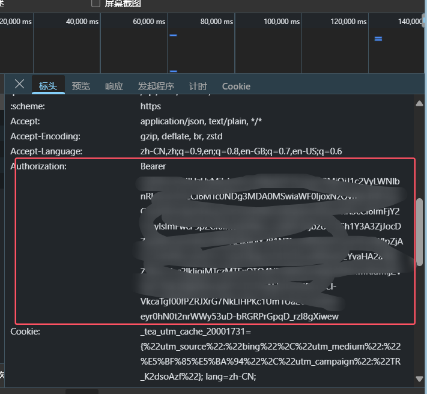
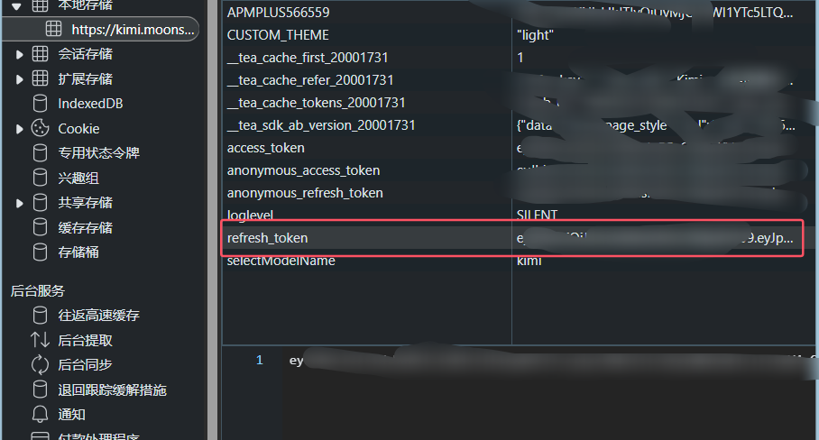
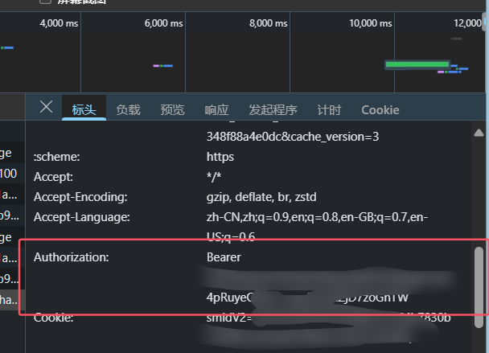
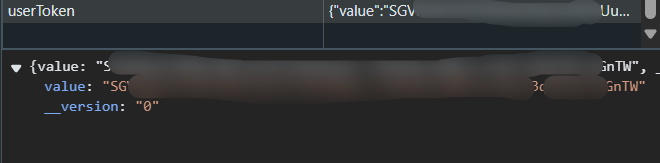
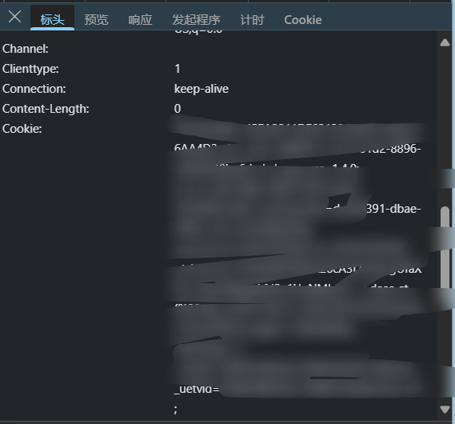
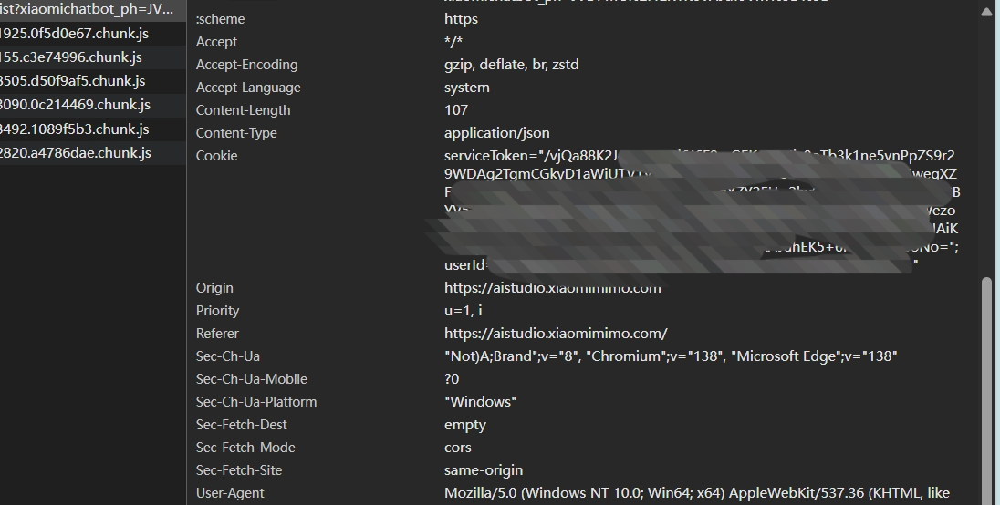

# 逆向工程练习仓库

## 🚨 免责声明

**注意事项**：

本仓库中的所有代码、工具和资料仅供学习和研究目的。使用这些资源需遵守以下严格准则：

- 所有代码和分析**必须**严格遵守法律和道德标准
- **禁止**将本仓库内容用于任何非法或未经授权的活动

加密参数以及算法隔段时间都在更新，不保证长期都有效

## 注：逆向API是不稳定的，建议前往各官方付费使用API，避免封禁的风险。
## kimi Bearer token获取处
进入kimi官方，打开控制台然后随便发送一条消息找到如图此处这一串就是token：

或者进入应用程序本地存储找到refresh_token,然后在前面加上Bearer：

## deepseek Bearer token获取处，与上述一致

或者应用程序本地存储处：

## 讯飞星火 cookie 获取
### 注：讯飞星火有url跳转，打开控制台会跳转到about:blank,先在url后面加个bug=s，如 https://xinghuo.xfyun.cn/desk?bug=s ，这样就不会跳转正常打开获取cookie

## MiMo cookie 获取

## 另QQ音乐获取cookie及刷新cookie算法和网易云获取cookie算法：

https://github.com/ZWD11/qqmusic-wyy-qrlogin-cookie

## QQ音乐官转api：
https://github.com/ZWD11/QQmusicApi
